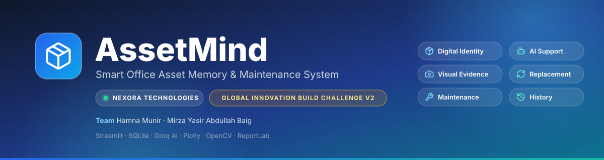

<p align="center">
  
</p>

<h1 align="center">🧠 AssetMind</h1>

<p align="center">
  <b>Smart Office Asset Memory & Maintenance System</b><br>
  Give every physical asset a digital memory.
</p>

<p align="center">
  Built for <b>Nexora Technologies</b> · Hackathon Prototype
</p>

<p align="center">
  
  
  
  
</p>

<p align="center">
  
  
  
  
  
</p>

<p align="center">
  <i>
    Physical object → Digital identity → Visual evidence → Condition →
    Maintenance → Repair → Replacement → Historical memory
  </i>
</p>

---

## 🧠 What is AssetMind?

**AssetMind is a digital memory and lifecycle system for physical office assets.**

Traditional inventory systems can tell you:

> "We have 280 assets."

AssetMind is designed to answer a different question:

> **"What has happened to each of those 280 assets?"**

A laptop gets repaired.

A chair gets damaged.

A monitor is replaced.

A UPS develops an issue.

Someone reports a problem.

A technician fixes it.

Without a proper lifecycle system, these events can disappear into emails, spreadsheets, conversations, or someone's memory.

**AssetMind gives every physical object a persistent digital identity that remembers its lifecycle.**

Every important event becomes part of the asset's history.

Nothing is silently forgotten.

Nothing is deleted simply because an asset retires.

Instead, AssetMind preserves the relationship:

```text
Original Asset
      ↓
Maintenance
      ↓
Repair
      ↓
Retirement
      ↓
Replacement
```

This creates an auditable digital memory for the physical workplace.

---

## 🎯 The Problem

Office assets are often managed as records rather than as **long-lived objects with history**.

Consider a chair that has been repaired three times.

A basic inventory system might show:

```text
Chair C-018
Status: Active
```

AssetMind can preserve the complete lifecycle:

```text
Chair C-018
│
├── Registered
├── Assigned to Engineering
├── Damage reported
├── Maintenance requested
├── Repaired
├── Damage reported again
├── Repaired
├── Damage reported again
├── Replacement requested
├── Retired
└── Replaced by C-142
```

Instead of looking at a single snapshot, users can understand the **history of the asset**.

---

## 💡 Core Idea

AssetMind is built around one simple pipeline:

```text
Physical Object
       ↓
Digital Identity
       ↓
Visual Evidence
       ↓
Condition
       ↓
Maintenance
       ↓
Repair
       ↓
Replacement
       ↓
Historical Memory
```

The asset is not just a row in a database.

It becomes a **persistent digital entity with a lifecycle**.

---

# ✨ Key Features

## 🏠 Live Dashboard

A real-time overview of the organization's asset fleet.

Includes:

* Total assets
* Active assets
* Assets under maintenance
* Damaged assets
* Repaired assets
* Retired assets
* Asset type distribution
* Department distribution
* Location distribution
* Maintenance activity

Interactive visualizations are powered by **Plotly**.

---

## 📦 Complete Asset Profiles

Every asset receives a unique digital identity.

Users can search and filter assets and open a detailed profile containing:

* Asset ID
* Asset type
* Department
* Location
* Assignment information
* Current condition
* Current status
* Purchase information
* Maintenance history
* Repair history
* Inspection records
* Replacement information
* Complete event timeline

The asset's historical record remains available throughout its lifecycle.

---

## 🔧 Maintenance Workflow

AssetMind provides a structured maintenance lifecycle:

```text
Issue Reported
      ↓
Under Review
      ↓
Repair / Replacement Decision
      ↓
Repair or Replacement Requested
      ↓
Resolved / Retired
```

Every transition is recorded.

This prevents maintenance history from disappearing after an issue has been resolved.

---

## 📸 AI Visual Inspection

AssetMind uses a Groq vision-capable model to inspect photographs of physical assets.

The important design decision is that the AI is intentionally **constrained by visual evidence**.

### ✅ What AI can identify

For example:

```text
Visible:
- Torn upholstery
- Cracked plastic
- Scratched surface
- Broken visible component
- Visible physical damage
```

### ❌ What AI should not invent

The model should not claim that an image proves:

```text
Not visually verifiable:
- Internal power supply failure
- Hidden motherboard damage
- Internal wiring problems
- Component-level electrical faults
```

Instead, uncertain cases can be routed toward:

> **Manual inspection required**

This is intentional.

**AI is used as decision support, not as an autonomous technician.**

---

## 🛡️ AI Safety by Design

One of the central engineering principles behind AssetMind is:

> **The AI should never claim more than the available evidence supports.**

The vision workflow combines:

* Constrained prompting
* Visual-evidence requirements
* Confidence handling
* Post-processing
* Manual inspection fallback

If the result does not meet the required confidence or evidence threshold, the application can override the model's response and require manual inspection.

This creates a deterministic safety layer around probabilistic AI.

---

# 🤖 Ask AssetMind

AssetMind includes a natural-language assistant for querying the asset database.

Users can ask questions such as:

> "Which assets need attention?"

> "How many laptops are currently under maintenance?"

> "Which assets were repaired more than twice?"

> "Which department has the most damaged assets?"

The important part is **how the answers are produced**.

The LLM does **not** receive unrestricted access to the database.

Instead:

```text
User Question
      ↓
Intent / Question Routing
      ↓
Approved Python Database Function
      ↓
SQLite Query
      ↓
Verified Results
      ↓
Groq AI Explanation
      ↓
Natural-Language Answer
```

The database provides the numbers.

The AI explains the numbers.

This reduces the risk of hallucinated statistics and prevents the model from directly manipulating the database.

> **The database owns the facts. The AI explains the facts.**

---

# 🏷️ QR Asset System

Every asset can have a unique QR code.

Users can:

* Generate QR codes
* Download QR codes
* Scan asset codes
* Open asset information
* Search by asset ID

This connects the physical workplace directly to the digital asset record.

```text
Physical Asset
      ↓
    QR Code
      ↓
Digital Asset Profile
      ↓
History + Maintenance + Condition
```

---

# 📊 Monthly Reports

AssetMind can generate monthly maintenance reports containing:

* Maintenance statistics
* Asset status information
* Repair activity
* Replacement activity
* CSV exports
* PDF reports
* AI-generated executive summaries

The AI summary is generated from statistics already calculated by Python.

The model is not responsible for inventing or calculating the underlying numbers.

```text
Database
   ↓
Python Statistics
   ↓
Verified Report Data
   ↓
AI Summary
   ↓
Executive Report
```

---

# 🔗 Replacement Chain

Assets are never simply deleted when they reach the end of their useful life.

Instead:

```text
Old Asset
    ↓
Retired
    ↓
Replacement Created
    ↓
Assets Linked
```

For example:

```text
Laptop L-042
      │
      ├── Maintenance
      ├── Repair
      ├── Replacement Request
      └── Retired
              │
              ↓
        Laptop L-157
```

The original asset remains available for historical and audit purposes.

This preserves the relationship between old and replacement equipment.

---

# 🏢 Demo Environment

AssetMind is demonstrated using **Nexora Technologies**, a fictional software company.

The demo environment contains approximately:

| Category         |    Demo Environment |
| ---------------- | ------------------: |
| Assets           |                ~280 |
| Departments      |                   6 |
| Office Locations |                   8 |
| Asset Types      |            Multiple |
| Data             | Synthetic demo data |

Example assets include:

* 💻 Laptops
* 🖥️ Desktops
* 🖥️ Monitors
* 🪑 Chairs
* ⌨️ Keyboards
* 🔋 UPS units
* 🖱️ Other office equipment

Most records are synthetic so the complete lifecycle can be demonstrated safely.

---

# 🏗️ Architecture

AssetMind intentionally uses a simple architecture.

There is:

* No separate frontend
* No separate backend
* No microservice infrastructure
* No unnecessary orchestration layer

Everything runs as a modular **Python + Streamlit** application.

```text
                    ┌─────────────────────┐
                    │      Streamlit      │
                    │         UI          │
                    └──────────┬──────────┘
                               │
              ┌────────────────┼────────────────┐
              │                │                │
              ▼                ▼                ▼
        ┌──────────┐     ┌──────────┐    ┌──────────┐
        │ Services │     │    AI    │    │Components│
        └────┬─────┘     └────┬─────┘    └──────────┘
             │                │
             │                ▼
             │          ┌───────────┐
             │          │   Groq    │
             │          │    API    │
             │          └───────────┘
             │
             ▼
       ┌─────────────┐
       │ SQLAlchemy  │
       │   + SQLite  │
       └─────────────┘
```

---

# 🛠️ Tech Stack

| Technology     | Purpose                       |
| -------------- | ----------------------------- |
| **Python**     | Application logic             |
| **Streamlit**  | Web application               |
| **SQLite**     | Persistent database           |
| **SQLAlchemy** | Database ORM                  |
| **Groq API**   | AI text + vision capabilities |
| **Plotly**     | Interactive charts            |
| **OpenCV**     | Image processing              |
| **Pillow**     | Image handling                |
| **qrcode**     | QR code generation            |
| **ReportLab**  | PDF generation                |
| **Pandas**     | Data processing and reports   |

### AI Architecture

AI models are used for two separate purposes:

**1. Vision AI**

Used for visual asset inspection and evidence extraction.

**2. Text AI**

Used for:

* Natural-language database Q&A
* Report summaries
* Explanation of verified results

The AI layer is intentionally separated from the system of record.

---

# 📂 Project Structure

```text
assetmind/
│
├── app.py
│   └── Main application entry point
│
├── pages/
│   └── Streamlit application pages
│
├── database/
│   ├── Database connection
│   ├── Models
│   ├── Schema
│   └── Seed/demo data
│
├── ai/
│   ├── Groq client
│   ├── Vision inspection
│   ├── Assistant routing
│   └── AI prompts
│
├── services/
│   ├── Asset management
│   ├── Maintenance
│   ├── History
│   ├── Reports
│   └── QR generation
│
├── components/
│   ├── Charts
│   ├── Timelines
│   └── Status components
│
├── utils/
│   ├── Validators
│   ├── Helpers
│   └── PDF export
│
├── uploads/
│   └── Local asset/inspection/repair/QR files
│
├── docs/
│   └── banner.svg
│
├── config.py
├── requirements.txt
├── .env.example
└── README.md
```

---

# 🚀 Getting Started

## 1. Clone the repository

```bash
git clone <your-repo-url>
cd assetmind
```

## 2. Create a virtual environment

### Windows

```bash
python -m venv venv
venv\Scripts\activate
```

### macOS / Linux

```bash
python -m venv venv
source venv/bin/activate
```

## 3. Install dependencies

```bash
pip install -r requirements.txt
```

## 4. Configure Groq

Copy the example environment file.

### Windows

```bash
copy .env.example .env
```

### macOS / Linux

```bash
cp .env.example .env
```

Add your API key:

```env
GROQ_API_KEY=your_key_here
```

## 5. Run AssetMind

```bash
streamlit run app.py
```

On the first run, AssetMind automatically initializes the SQLite database and creates the demo dataset.

---

# ☁️ Deployment

AssetMind can be deployed using **Streamlit Community Cloud**.

### Steps

1. Push the repository to GitHub.
2. Create a new Streamlit application.
3. Point the application to:

```text
app.py
```

4. Add the Groq API key to Streamlit Secrets:

```toml
GROQ_API_KEY = "your_key_here"
```

5. Deploy.

> ⚠️ Never commit your real `.env` file or API keys to GitHub.

---

# 🎬 3-Minute Demo Flow

The recommended demonstration follows a complete asset lifecycle.

## 1. Dashboard

Start with the organization-wide view.

Show:

* ~280 assets
* Departments
* Locations
* Asset statuses
* Maintenance statistics

---

## 2. Asset Profile

Open an asset such as:

```text
C-018
```

Show its complete historical timeline.

---

## 3. Report an Issue

Create a maintenance issue and attach a photograph.

---

## 4. AI Inspection

Run the Groq vision inspection.

Show how the system:

* Identifies visible evidence
* Avoids unsupported diagnoses
* Requests manual inspection when evidence is insufficient

---

## 5. Maintenance Workflow

Move the ticket through the lifecycle:

```text
Reviewing
   ↓
Replacement Requested
   ↓
Retire Asset
```

---

## 6. Create Replacement

Create the replacement asset and show the relationship between the old and new assets.

The old asset remains in the database.

---

## 7. Ask AssetMind

Try:

```text
Which assets need attention?
```

Then:

```text
Which assets were repaired more than twice?
```

Show that the answers come from actual database results.

---

## 8. Reports

Generate the monthly maintenance report and export it as CSV/PDF.

---

# 🧩 Why AssetMind Is Different

AssetMind is not simply:

> **"An inventory system with a chatbot."**

The project focuses on three core ideas.

## 1. Digital Memory

Every physical asset maintains a persistent lifecycle history.

The system remembers:

```text
What it is
     ↓
Where it is
     ↓
Who uses it
     ↓
What happened to it
     ↓
What was repaired
     ↓
What was replaced
     ↓
What replaced it
```

---

## 2. Evidence-Based AI

AI responses are constrained by:

* Available visual evidence
* Verified database results
* Explicit application logic
* Defined confidence requirements

The AI does not become the system of record.

---

## 3. Human-in-the-Loop Decisions

The AI assists technicians and managers rather than pretending to replace them.

When evidence is insufficient:

```text
Uncertain AI Result
       ↓
Manual Inspection
       ↓
Human Decision
```

The goal is not to make AI autonomous.

The goal is to make AI **useful, constrained, and accountable**.

---

# 🧠 Engineering Principles

AssetMind was built around several principles:

```text
AI should explain evidence,
not invent evidence.

Python should calculate facts,
not the LLM.

The database should own the data,
not the AI.

Uncertainty should trigger inspection,
not speculation.

Retirement should preserve history,
not erase it.
```

### The Core Principle

> **The database owns the facts. The AI explains the facts.**

This separation keeps deterministic business logic and probabilistic AI responsibilities clearly defined.

---

# ⚠️ Known Limitations

## Local Storage

The current deployment stores:

```text
uploads/
assetmind.db
```

locally.

On Streamlit Community Cloud, local storage can be ephemeral across redeployments or application lifecycle events.

The storage layer is intentionally modular so it can later be replaced with:

* Cloud object storage
* Managed databases
* Persistent file storage

---

## AI Is Decision Support

The vision model does not perform professional hardware diagnosis.

It reports visually observable evidence and can defer to manual inspection.

AI output should therefore be treated as **decision support rather than a definitive technical diagnosis**.

---

## Synthetic Demo Data

Most of the approximately 280 assets are generated demonstration records.

Real physical objects can be photographed for live AI inspection demonstrations.

---

## Hackathon Prototype

AssetMind is a functional hackathon prototype and is **not currently positioned as a production-ready enterprise asset-management platform**.

Production deployment would require additional work around:

* Authentication
* Authorization
* Persistent cloud storage
* Database scalability
* Observability
* Security hardening
* Backup and recovery
* Multi-user concurrency
* Enterprise integrations

---

# 🔮 What's Next?

Future versions could expand AssetMind with:

* 📱 Mobile asset scanning
* 🔍 Automatic serial-number/OCR extraction
* 📸 Automatic asset registration from images
* 📈 Predictive maintenance
* 💰 Repair-vs-replacement cost analysis
* 👥 Role-based access control
* ☁️ Cloud database and object storage
* 🔔 Automated maintenance reminders
* 👨‍🔧 Technician assignment
* 📊 Advanced lifecycle analytics
* 💵 Asset depreciation tracking
* 🔗 Procurement system integration
* 🏢 Multi-company / multi-tenant support
* 📅 Maintenance scheduling
* 📉 Failure and repair trend analysis

The long-term vision is:

> **A digital memory layer for the physical workplace.**

---

# 🏆 Hackathon Project

AssetMind was built as a hackathon project with a focus on combining:

**LLMs + Vision AI + Structured Data + Lifecycle Management + Human-in-the-Loop Safety**

The project demonstrates that an effective AI application does not necessarily need to give AI unlimited freedom.

Sometimes the stronger engineering decision is to give AI:

* Clear boundaries
* Verified data
* Explicit responsibilities
* Deterministic safeguards
* Human oversight

The result is an AI system designed to be **useful, constrained, and accountable**.

---

# 📌 Project Summary

```text
AssetMind
│
├── Digital Asset Identity
├── Lifecycle History
├── Maintenance Management
├── AI Visual Inspection
├── Evidence-Based AI
├── Natural-Language Database Q&A
├── QR Asset Tracking
├── Replacement Chains
├── Monthly Reports
└── Human-in-the-Loop Safety
```

---

<p align="center">
  <b>🧠 AssetMind</b><br>
  Smarter Assets. Better Decisions. Persistent Memory.
</p>

<p align="center">
  <i>
    Physical object → Digital identity → Visual evidence → Condition →
    Maintenance → Repair → Replacement → Historical memory
  </i>
</p>

<p align="center">
  Built with Python · Streamlit · SQLite · SQLAlchemy · Groq · Plotly
</p>

<p align="center">
  <sub>
    Built as a hackathon prototype. Not a production-ready enterprise system.
  </sub>
</p>

---

## 📄 License

This project is licensed under the **MIT License**.
